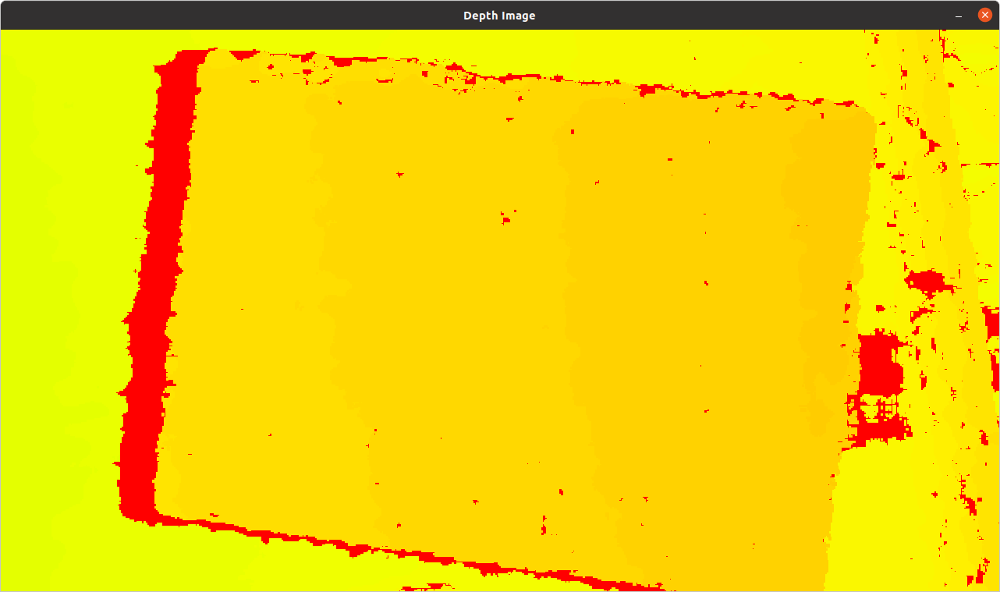
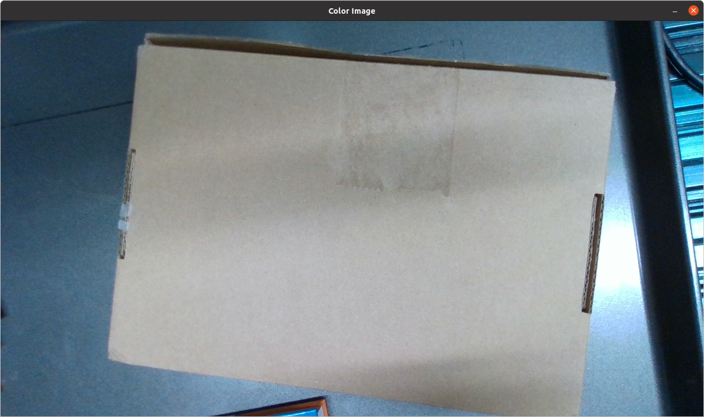
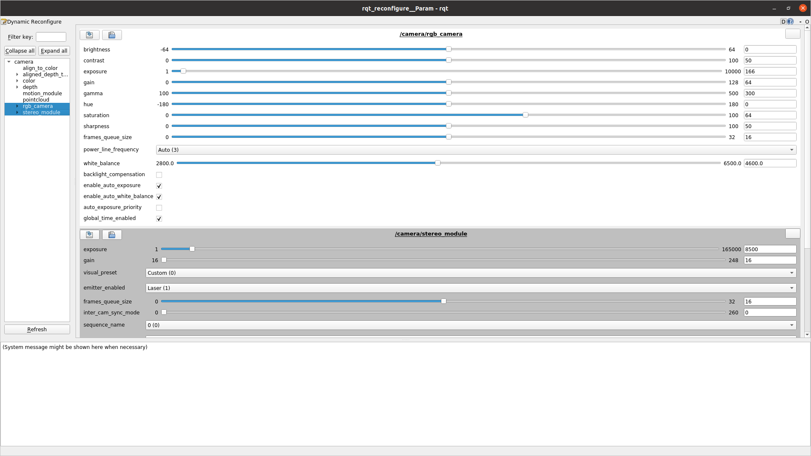

# README

> - 本功能包是使用`RealSense`相机的功能包, 里面包含一些自定义的相机功能, 仅用于展示, 实际开发过程中建议使用官方的ROS功能包, 已经在`container`中安装好了.
> - 有关`RealSense`相机的使用, 可以参考[这个文档](../docs/Hardware/1.Realsense_camera.md)

## 1. 目录说明
```bash{.line-numbers}
realsense_camera/
├── CMakeLists.txt
├── README.md
├── launch
│   └── camera_vis_set_parameters.launch
├── package.xml
└── src
    ├── image_vis.py
    └── py_realsense_vis.py
```
- `CMakeLists.txt`: 用来编译此package的cmake文件
- `README.md`: 此package说明文件
- `launch`: 包含此软件包的launch files
- `package.xml`: 包含此软件包的元数据和依赖关系
- `src`: 包含此软件包的可执行源文件

我们想要添加功能, 就需要在`src`目录下添加可执行文件(`Python`/`C++`)

并在`CMakeLists.txt`文件中添加这些文件, 具体如何使用这些可执行文件作为ROS节点可以看[这个文档](../docs/ROS_basics/add_executable_files.md).

## 2. 功能说明
- 使用Python可视化相机输出: [image_vis.py](src/image_vis.py)

可以通过两种方法启动, 一个是直接使用 `rosrun`, 一个是通过写好的 `launch file`:

**方式1:**
```bash{.line-numbers}
roslaunch realsense2_camera rs_camera.launch align_depth:=true

# open another terminal, remember to source the setup file
rosrun realsense_camera image_vis
```

这样会看到如下两个窗口分别显示相机拍到的深度图与彩色图
|  |  |
| :--------------------------------------: | :------------------------: |
|         **Aligned Depth Image**          |      **Color Image**       |


**方式2(推荐):**

```bash{.line-numbers}
roslaunch realsense_camera camera_vis_set_parameters.launch
```

除了方式1打开的图像窗口外, 方式2还会打开一个调节相机参数的界面, 可以通过滑块的方式调节相机的曝光等参数.

|  |
| :----------------------------------------------------: |
|           **Parameter Configuration Screen**           |

> > :memo: **Note**
>
> 如果左边没有显示可调节的选项, 点击下方的刷新即可